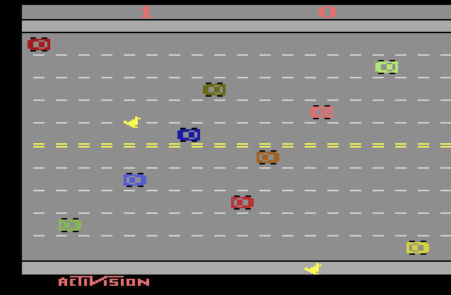

Freeway - jogo de Atari

Projeto desenvolvido no curso de programação da Alura para simular esse clássico lançado pela Atari

# Freeway

O Freeway é um game que simula uma vaquinha tentando atravessar a pista até chegar ao outro lado sem ser atropelada, parecido com o jogo original lançado pela Atari de <a href="https://www.youtube.com/watch?v=8cd5VPARfNM">Freeway</a> na década de 80 que simulava uma galinha fazendo a travessia.

## ✔️ Técnicas e tecnologias utilizadas

Se liga nessa lista de tudo que usamos nesse projeto:

- `Javascript`
- `Bibliotecas P5 : collide2d, draw, preload, setup, loadSound, loadImage`
- `Editor p5js: https://editor.p5js.org/`
- `Eventos do Teclado`
- `GitHub`

E muito mais!

## 🛠️ Abrir e rodar o projeto

Para abrir e rodar o projeto, instale a extensão Live Server no VS Code e clicar com o botão direito do mouse na `index.html` para inicar o projeto com o Open Live Server.

Depois, o navegador abrirá sozinho no endereço da aplicação rodando o jogo em <a href="http://localhost:5500/">http://localhost:5500/</a>.

Ou experiemnte online <a href="https://editor.p5js.org/devdesignerstudio/full/XHlP_6WZ0">Aqui</a>

## 🏓 Como jogar ?

Utilize as teclas ⬆️ para mover para cima e ⬇️ para mover para baixo.
Bom jogo e divirta-se ! =)

## 📚 Mais informações do curso

O Freeway é um jogo para relembrar o sucesso da Atari Games utilizada nesse curso da Alura.

A ideia principal desse curso é evoluir ainda mais os conhecimentos em Javascript e seus fundamentos de forma agradável trazendo o cenário dos games.
